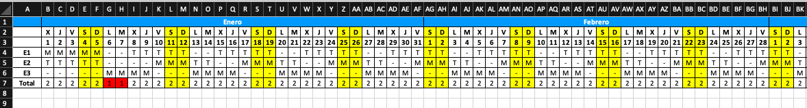

# planning
Planning Management

## Changelog

For a detailed list of changes, please refer to the [CHANGELOG](CHANGELOG.md).

## Install 

**Python version:** 3.13.0

Execute the following command from the project root:
```
pip install -r requirements.txt
````

## Samples

### Execution from VSCode:
```json
{
    "version": "0.2.0",
    "configurations": [
        {
            "name": "Planning",
            "type": "debugpy",
            "request": "launch",
            "program": "${workspaceFolder}/src/planning/planning.py",
            "cwd": "${workspaceFolder}/src/planning/",
            "env": {
                "PYTHONPATH": "${workspaceFolder}/src/planning"
            },
            "args": [
            ],
            "stopOnEntry": false,
            "justMyCode": false
        }
    ]
}
```

### Jupyter notebooks
There are two Jupyter notebooks (`basic_planning.ipynb` and `advanced_planning.ipynb`) that allow the generation of schedules.

### Num employees in each shift


### 3 employees:


### 30 days with 3 employees:


### 30 days with 3 employees:


### Transpose table



As can be seen in the screenshot, cells will appear in red when there are no people needed to cover the work positions.


### Export to Excel
```python
output_filename = "samples/m_a_2025.xlsx"
employees_info.index = pd.to_datetime(employees_info.index)
employees_info.index = employees_info.index.strftime("%Y-%m-%d")
employees_info.to_excel(output_filename, sheet_name="Shift Schedule")
```

```python
output_filename = "samples/m_a_2025_transpose.xlsx"
transposed_employees_info.to_excel(output_filename, sheet_name="Shift Schedule")

workbook = load_workbook(output_filename)
worksheet = workbook["Shift Schedule"]

worksheet.delete_rows(4)

min_width = 3  # Puedes ajustar este valor según tus necesidades
for col in worksheet.iter_cols():
    for cell in col:
        if not any(
            cell.coordinate in merged_cell
            for merged_cell in worksheet.merged_cells.ranges
        ):
            column = cell.column_letter  # Obtener la letra de la columna
            worksheet.column_dimensions[column].width = min_width
            break

fill = PatternFill(start_color="0099FF", end_color="0099FF", fill_type="solid")
font = Font(color="FFFFFF", bold=True)

for cell in worksheet[1]:
    cell.fill = fill
    cell.font = font

weekend_fill = PatternFill(start_color="FFFF00", end_color="FFFF00", fill_type="solid")

thin_border = Border(
    left=Side(style="thin"),
    right=Side(style="thin"),
    top=Side(style="thin"),
    bottom=Side(style="thin"),
)

for col in worksheet.iter_cols(
    min_row=2, max_row=worksheet.max_row, min_col=2, max_col=worksheet.max_column
):
    day_of_week_cell = col[0]
    if day_of_week_cell.value in ["S", "D"]:
        for cell in col:
            cell.fill = weekend_fill

for row in worksheet.iter_rows(
    min_row=1, max_row=worksheet.max_row, min_col=1, max_col=worksheet.max_column
):
    for cell in row:
        cell.border = thin_border


workbook.save(output_filename)
```

