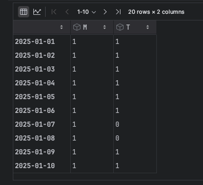
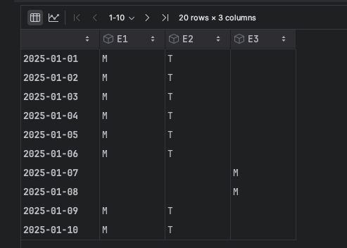
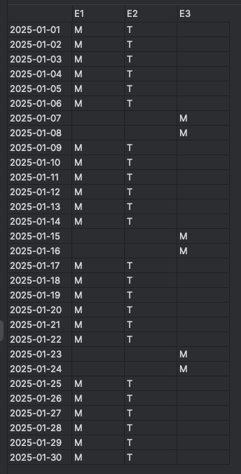
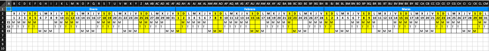

# planning
Planning Management

## Install 

**Python version:** 3.13.0

Execute the following command:
```
pip install -r requirements.txt
````

### Num employees in each shift



### 3 employees:



### 30 days with 3 employees:



### Sample with a transpose table


### Export to Excel
```
output_filename = "../samples/m_a_2025.xlsx"
employees_info.index = pd.to_datetime(employees_info.index)
employees_info.index = employees_info.index.strftime("%Y-%m-%d")
employees_info.to_excel(output_filename, sheet_name="Shift Schedule")
```