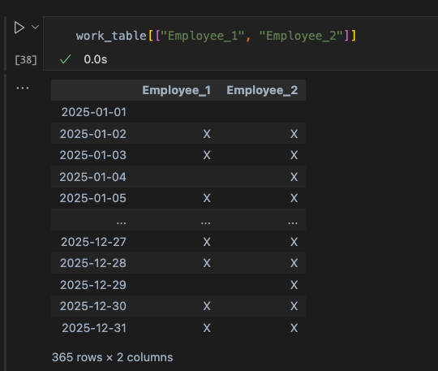

# planning
Planning Management

## Install 

**Python version:** 3.13.0

Execute the following command:
```
pip install -r requirements.txt
````

## Sample


### Filtering by 2 persons:



```
work_table[["Employee_1", "Employee_2"]].to_excel("employee_schedule_two_employees.xlsx", sheet_name="Work Schedule")
```