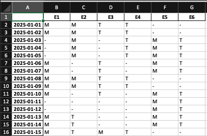
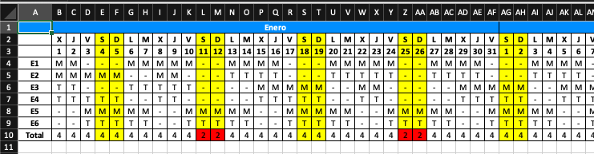
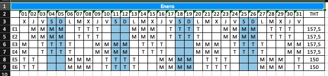
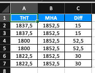

# Shift Planner

## Project Description
The Shift Planner is a tool designed to help manage and schedule work shifts for employees. It allows managers to create, modify, and view shift schedules, ensuring that all shifts are adequately covered.

## Changelog

For a detailed list of changes, please refer to the [CHANGELOG](CHANGELOG.md).

## Features
- Create and edit shift schedules
- Assign employees to shifts
- View shift schedules by day, week, or month
- Handle shift swaps and changes

## Installation Instructions
1. Clone the repository:
    ```sh
    git clone git@github.com:mguerrerof/shift-planner.git
    ```
2. Navigate to the project directory:
3. Install the required dependencies:
    ```sh
    pip install -r requirements.txt
    ```

**Python version:** 3.13.0
For more information on downloading Python, visit the [official Python downloads page](https://www.python.org/downloads/).

This link points to the [official documentation for pandas](https://pandas.pydata.org/), a powerful and flexible open-source data analysis and manipulation library for Python. Pandas provides data structures like DataFrame and Series, which are essential for handling structured data efficiently.

### Usage from VSCode:
Add this configuration in the `launch.json`.
```json
{
    "version": "0.2.0",
    "configurations": [
        {
            "name": "Planning",
            "type": "debugpy",
            "request": "launch",
            "program": "${workspaceFolder}/src/planning/planning.py",
            "cwd": "${workspaceFolder}/src/planning/",
            "env": {
                "PYTHONPATH": "${workspaceFolder}/src/planning"
            },
            "args": [
            ],
            "stopOnEntry": false,
            "justMyCode": false
        }
    ]
}
```

### Usage from Jupyter notebooks
There are two different example cases:
- **case_1**: it contains a group of 6 employees: E1, E2, E3, E4, E5 and E6.
- **case_2**: a company with 3 employees: E1, E2 and E3.

Templates are located in `src/notebooks` folder.

Data associated to each case are located in `data/2025/<case>`. There are 3 files:
- **config.json:** General information about the company.
````json
{
    "start_date": "2025-01-01",
    "num_days": 365,
    "employee_restrictions": {
        "hours_per_shift": 7.5,
        "max_hours_week_employee": 37.5,
        "max_hours_year_employee": 1852.5,
        "min_weekend_rest_month_employee": 1,
        "max_timeoff_employee": 2,
        "shifts": [
            "M",
            "T"
        ],
        "max_persons_per_shift": {
            "M": 1,
            "T": 1
        },
        "min_persons_per_shift": {
            "M": 1,
            "T": 1
        }
    }
}
````

- **employees.yaml:** Information associated to each employee.
```yaml
E1:
 capacity: 1
 name: E1
E2: 
 capacity: 1
 name: E2
E3:
 capacity: 1
 name: E3 
```

- **vacations.yaml:** Vacations days associated to each employee.
```yaml
E1:
  - 2025-01-01
E2:
E3:
  - 2025-01-01
  - 2025-01-02
  - 2025-01-03
```

Files will be generated in `output/2025/<case>`folder.

Examples:

#### planning_generated


#### planning_generated with styles


#### planning_generated from xlsx




- **THT**: Total hours worked.
- **MHT**: Maximum hours to work.
- **Diff** : MHT - THT.